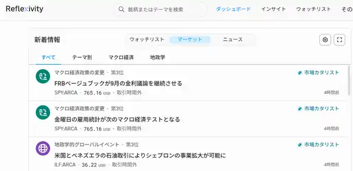

<!--
id: RX-USECASE-0049
type: use-case
language: zh
locale: zh-HK
provider: QUICK Inc.
provided: 2026-09-03
status: published
translation_status: current
source_type: partner-provided-use-case
asset_class: Macro, Equities, Fixed Income
roles: Wealth Management / RIA, Long-only Asset Manager, Hedge Fund Tier 1
publication_mode: faithful-source-preserving
-->

# 用 Market Catalyst 快速篩選 Beige Book 重點

[← 宏觀使用案例](README.md) · [按資產類別瀏覽](../README.md) · [全部使用案例](../../README.md)

**提供日期：** 2026-09-03  
**主要資產：** 宏觀、股票、固定收益  
**適用使用者：** 財富管理 / RIA、Long-only Asset Manager、對沖基金

> 本案例保留來源的工作流程及解說次序。

來源以聯儲局 Beige Book 為例，展示如何利用 Market Catalyst 檢視重大新聞分析。

## 甚麼時候適合使用

Beige Book 這類文件包含大量資訊。在很多投資工作流程中，第一步未必是逐行閱讀全文，而是先找出**哪些內容最可能影響市場**，再決定哪個地區或主題值得深入研究。

Market Catalyst 提供由事件 headline 進入分析的入口。流程先把 feed 收窄至使用者的覆蓋範圍，找出相關事件，再打開詳細的市場解讀。

## 工作流程

如果尚未設定國家、地區或主題，Market Catalyst 畫面可能是空白。來源建議：

1. 打開 **Insights**，選擇 **Market Catalyst**；
2. 設定相關主題、國家或地區，其中一個 filter 已足夠；
3. 從結果中選擇 Beige Book 等重要事件；
4. 打開事件，查看重點及市場含義。

先設定覆蓋範圍，不是單純為了少看一些新聞，而是要優先處理與投資組合或研究 mandate 最相關的事件。

研究次序可以概括為：

**覆蓋 filter → 市場相關事件 → 關鍵重點 → 下一個深入研究目標。**

## 如何使用結果

價值不只在於得到一個較短的 Beige Book 摘要，而在於回答：**下一步應該研究甚麼？**

例如識別出一項市場相關的 Beige Book 訊息後，分析員可以直接深入與投資組合最相關的地區、板塊、通脹、就業或政策問題，而不是把整份文件每一部分都視為同等重要。

## 本使用案例說明了甚麼

這是一個由廣泛資訊來源進入優先研究路徑的工作流程：先設定相關覆蓋範圍，辨識重要 catalyst，閱讀分析，再用它決定下一個研究問題。

---

本內容由 QUICK 提供。

視乎國家或地區、語言環境、使用產品、權限及數據涵蓋範圍，未必可以完全按本文方式重現本案例。

[← 宏觀使用案例](README.md) · [按資產類別瀏覽](../README.md) · [全部使用案例](../../README.md)
